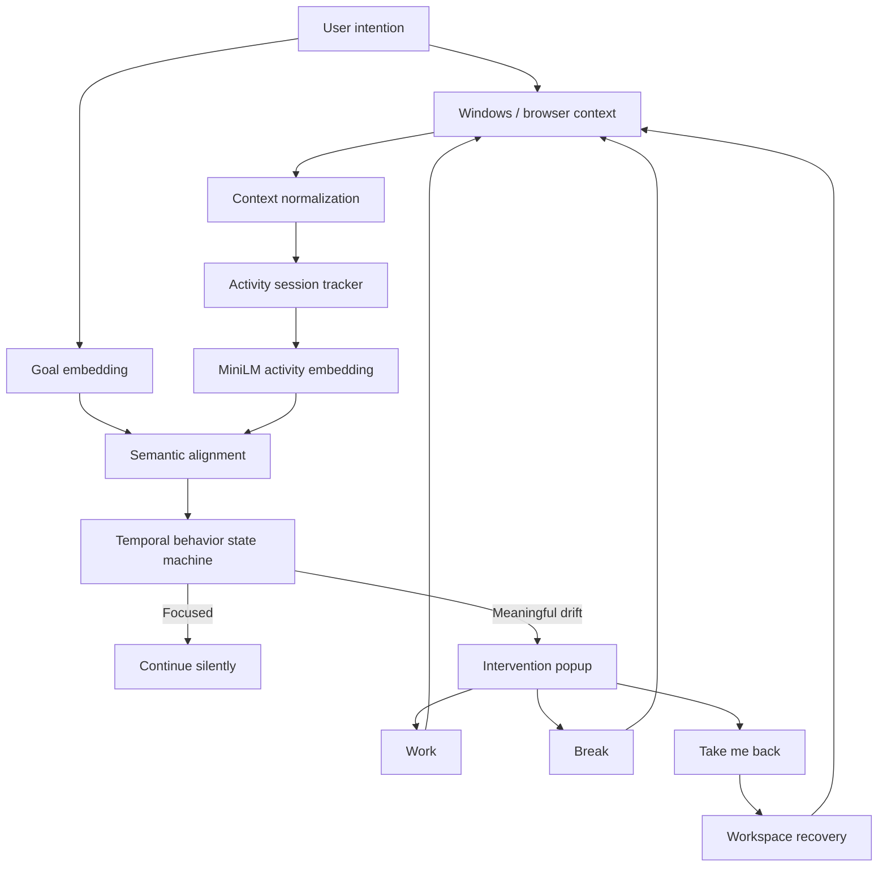

# LOCKEDIN

> **Your AI for staying locked in.**
>
> A private, on-device AI coworker that understands what you are actually trying to do.

LOCKEDIN is an **intention-aware focus system** for Windows. Instead of treating apps or websites as inherently productive or distracting, it builds an understanding of the user's declared intention, observes the active desktop context, measures semantic alignment, tracks behavior over time, and intervenes only when distraction becomes meaningful.

It is deliberately **not** a screen-time dashboard, website blocker, generic chatbot, or cloud-based productivity assistant.

---

## Table of contents

- [1. Why LOCKEDIN exists](#1-why-lockedin-exists)
- [2. Core idea](#2-core-idea)
- [3. What the system actually does](#3-what-the-system-actually-does)
- [4. End-to-end architecture](#4-end-to-end-architecture)
- [5. Semantic reasoning engine](#5-semantic-reasoning-engine)
- [6. Temporal behavior model](#6-temporal-behavior-model)
- [7. Task destination and workspace recovery](#7-task-destination-and-workspace-recovery)
- [8. Intervention and voice personality](#8-intervention-and-voice-personality)
- [9. Privacy and local-first design](#9-privacy-and-local-first-design)
- [10. Qualcomm AI Hub integration](#10-qualcomm-ai-hub-integration)
- [11. Snapdragon validation evidence](#11-snapdragon-validation-evidence)
- [12. AI Hub performance table](#12-ai-hub-performance-table)
- [13. Why Qualcomm AI Hub matters](#13-why-qualcomm-ai-hub-matters)
- [14. GenAI clarification](#14-genai-clarification)
- [15. Example session](#15-example-session)
- [16. Engineering trade-offs](#16-engineering-trade-offs)
- [17. Repository structure](#17-repository-structure)
- [18. Local development](#18-local-development)
- [19. Reproducing the Qualcomm validation](#19-reproducing-the-qualcomm-validation)
- [20. Validation checklist](#20-validation-checklist)
- [21. Current limitations](#21-current-limitations)
- [22. Future deployment path](#22-future-deployment-path)
- [23. Engineering philosophy](#23-engineering-philosophy)
- [24. References](#24-references)

---

## 1. Why LOCKEDIN exists

Modern computers already know a surprising amount about what the user is doing:

- which window is active
- which process owns it
- which browser page is open
- which URL is being viewed
- which application is currently foregrounded

What they generally do **not** know is whether that activity is still aligned with what the user intended to accomplish.

That distinction is the core problem.

A user can legitimately:

- browse Instagram because their goal is to scroll Instagram
- watch YouTube because their goal is to study a lecture
- open ChatGPT because their goal is to debug code
- switch to VS Code because their goal is to finish an assignment

The same website can therefore be either **relevant or unrelated** depending on the user's intention.

LOCKEDIN makes the intention explicit and lets the rest of the system reason from it.

---

## 2. Core idea

The user begins with one statement:

> **What are you trying to accomplish?**

That intention becomes the session's reference point.

The system then runs this loop continuously:

```text
USER INTENTION
      ↓
LOCAL CONTEXT UNDERSTANDING
      ↓
LOCAL SEMANTIC REASONING
      ↓
GOAL ↔ ACTIVITY ALIGNMENT
      ↓
TEMPORAL BEHAVIOR ANALYSIS
      ↓
FOCUS / DISTRACTION DECISION
      ↓
INTERVENTION
      ↓
USER RESPONSE
      ↓
RECOVERY
```

The important design decision is that **semantic relevance and behavioral action are separate problems**.

```text
MiniLM
  ↓
"What am I looking at?"
  ↓
Alignment Engine
  ↓
"Is it related to my intention?"
  ↓
Temporal State Machine
  ↓
"Has this become meaningful distraction?"
  ↓
Intervention
```

This prevents a single low similarity score from immediately turning into an annoying popup.

---

## 3. What the system actually does

| Capability | LOCKEDIN behavior |
|---|---|
| User intention | Declared once at session start and kept stable |
| Desktop context | Active window, process, browser title and URL |
| Context normalization | Converts noisy window/browser metadata into comparable text |
| Semantic understanding | `all-MiniLM-L6-v2` sentence embeddings |
| Embedding size | 384 dimensions |
| Alignment | Goal vs current activity semantic comparison |
| Temporal reasoning | Activity session tracking + state machine |
| Short switches | Brief <5 s context changes can be ignored |
| Distraction history | Multiple unrelated activities can belong to one continuous episode |
| Intervention | Triggered from sustained or repeated unrelated behavior |
| Recovery | Restores the last established relevant task destination |
| Voice | 23 locally stored WAV clips, randomized and non-repeating consecutively |
| Privacy | Context processing remains local to the machine |
| Persistent recording | None |
| Cloud semantic dependency | None |
| System control | Persistent Windows tray icon |
| Deployment model | Local desktop AI with Snapdragon-targeted model validation |

### Intention is the source of truth

LOCKEDIN does **not** maintain rules such as:

```text
Instagram = distraction
YouTube   = productive
ChatGPT   = productive
```

Instead:

```text
Goal: "SCROLL INSTAGRAM"
Instagram → relevant

Goal: "FINISH PYTHON HOMEWORK"
Instagram → unrelated
```

That makes the system domain-agnostic.

---

## 4. End-to-end architecture



### Major components

| Layer | Component | Responsibility |
|---|---|---|
| Input | `WindowsContextObserver` | Active window/process metadata |
| Browser | `BrowserContextProvider` | Browser title + URL context |
| Normalization | `ContextNormalizer` | Produces stable semantic activity text |
| Embeddings | `MiniLMEmbedder` | Converts text into 384-D vectors |
| Alignment | `AlignmentEngine` | Computes goal/activity relevance |
| Sessions | `ActivitySessionTracker` | Groups stable activities into sessions |
| Behavior | `FocusStateMachine` | Decides when drift becomes actionable |
| UI | `InterventionPopup` | Presents recovery choices |
| Recovery | `WorkspaceRecovery` | Restores the last relevant destination |
| Voice | `VoicePersonality` | Local intervention voice clips |
| Process shell | `LockedInTray` | Persistent session control |
| Monitor | `LockedInMonitor` | Orchestrates the entire runtime loop |

---

## 5. Semantic reasoning engine

### 5.1 Why MiniLM

LOCKEDIN does not need a generative LLM to answer every desktop event.

The core question is usually much smaller:

> **Are these two pieces of text semantically related?**

`all-MiniLM-L6-v2` is well suited to that task because it converts text into compact sentence embeddings that can be compared efficiently on-device.

### 5.2 Goal embedding

The declared intention is embedded once at the start of a session:

```text
Goal text
   ↓
all-MiniLM-L6-v2
   ↓
384-dimensional goal vector
```

Current activity is embedded only when the normalized activity changes.

```text
Active context
   ↓
Normalization
   ↓
Activity text
   ↓
all-MiniLM-L6-v2
   ↓
384-dimensional activity vector
```

### 5.3 Semantic alignment

The alignment engine combines semantic similarity with normalized lexical/concept overlap and emits a relevance decision.

Illustrative evidence from a real LOCKEDIN run:

| Goal | Activity | Decision | Combined score |
|---|---|---|---:|
| `SCROLL INSTAGRAM` | Instagram | Relevant | 0.5651 |
| `SCROLL INSTAGRAM` | ChatGPT challenge page | Unrelated | 0.1116 |

The semantic score is **not** the final behavioral decision. A temporal layer decides whether the unrelated activity has persisted long enough to matter.

---

## 6. Temporal behavior model

The system reasons about **time and transitions**, not isolated screenshots of state.

### Behavior contract

| Situation | LOCKEDIN behavior |
|---|---|
| Relevant activity remains relevant | No intervention |
| Relevant activity becomes stable >10 s | Can become the current task destination |
| Relevant → unrelated | Starts a distraction episode |
| Unrelated → unrelated | Continues the same distraction history |
| Very short switch | Can be ignored as noise |
| Sustained unrelated activity | Can escalate to intervention |
| Return to relevant + stability | Ends distraction history |
| Take Me Back | Restores the last established relevant destination |

### Why temporal state matters

Without temporal reasoning:

```text
One unrelated tab
        ↓
POPUP!
```

With temporal reasoning:

```text
Unrelated activity detected
        ↓
Is it just a short switch?
        ↓
Has it persisted?
        ↓
Has distraction accumulated?
        ↓
Only then → intervention
```

This is what keeps LOCKEDIN from becoming another noisy productivity tool.

---

## 7. Task destination and workspace recovery

A key differentiator is that LOCKEDIN remembers **where the user was actually working**, rather than taking a generic screenshot of the desktop.

A relevant activity becomes eligible as a destination only after it remains stable long enough to be considered intentional.

Examples include:

- a stable browser destination
- an Instagram PWA/browser destination
- a VS Code workspace and active file
- a foreground desktop application

When the user chooses **Take Me Back**, LOCKEDIN restores that last established relevant destination.

### Recovery semantics

```text
Relevant activity
       ↓
Stable > destination threshold
       ↓
Destination captured
       ↓
Distraction episode
       ↓
Intervention
       ↓
Take Me Back
       ↓
Restore destination
       ↓
Reset activity tracking
```

This closes the loop from **detection to recovery**.

---

## 8. Intervention and voice personality

LOCKEDIN is intentionally not a generic motivational assistant.

Its intervention personality is:

- dry
- sarcastic
- slightly unhinged
- familiar rather than corporate
- short enough to interrupt without becoming another distraction

### Local voice architecture

The project contains **23 locally stored WAV clips**.

| Voice property | Implementation |
|---|---|
| Clip count | 23 |
| Storage | Local WAV files |
| TTS dependency | None for the intervention layer |
| Selection | Randomized |
| Repeat behavior | Immediate repeats avoided |
| Playback | Asynchronous Windows playback |
| Network dependency | None |
| Shutdown | Playback is stopped with the LOCKEDIN session |

This makes the personality deterministic from an engineering perspective while still feeling unpredictable to the user.

---

## 9. Privacy and local-first design

LOCKEDIN is designed around a simple principle:

> **Your screen is your business.**

### Data-flow policy

```text
Windows / Browser context
        ↓
Local normalization
        ↓
Local embedding
        ↓
Local alignment
        ↓
Local state machine
        ↓
Local intervention
```

There is no required cloud API in the semantic decision loop.

### Privacy properties

| Property | LOCKEDIN |
|---|---|
| Semantic reasoning | Local |
| Screen recording | None required |
| Permanent screenshots | None required |
| LLM API call per event | No |
| Goal data | Used as the local session reference |
| Browser context | Processed locally |
| Voice assets | Local |
| Network dependency for normal semantic reasoning | None |

The architecture is therefore suitable for an **edge AI / private desktop agent** model rather than a cloud-first assistant.

---

## 10. Qualcomm AI Hub integration

LOCKEDIN uses Qualcomm AI Hub Workbench as the validation and deployment bridge for the semantic model.

The role of AI Hub in this project is broader than a screenshot of a benchmark number. It provides a concrete path to:

1. select a supported Snapdragon target
2. compile the model into a target-specific artifact
3. profile the compiled model on hosted Qualcomm hardware
4. inspect inference latency, memory behavior, and compute-unit utilization
5. validate the same semantic model across PC and mobile Snapdragon targets

Qualcomm documents compile and profile workflows through both the Python API and `qai-hub` CLI. It also supports device-family targets such as **Samsung Galaxy S25 (Family)**, where a workload can run on one of the supported S25 variants. 

### AI Hub flow used by LOCKEDIN

```text
MiniLM source model
       ↓
Qualcomm AI Hub
       ↓
Target-specific compile
       ↓
Optimized target model
       ↓
Profile / inference job
       ↓
Latency + memory + compute-unit evidence
```

The current Qualcomm device documentation describes `(Family)` targets as a way to target a device family rather than a single exact handset. Qualcomm's release notes also document the September 2026 migration from the removed Snapdragon 8 Elite device entry to **Samsung Galaxy S25 (Family)**. See the official references at the end of this README.

---

## 11. Snapdragon validation evidence

LOCKEDIN was profiled on two Snapdragon targets through Qualcomm AI Hub Workbench.

### 11.1 Snapdragon X Elite — compile and inference evidence

#### AI Hub jobs overview


The jobs overview shows the successful X Elite inference result alongside the failed experimental jobs that were not used for the reported result.

#### Detailed inference result


Key evidence visible in the result:

- target device: **Snapdragon X Elite CRD**
- Windows 11 target
- optimized model produced from compile job `jpe7n1oo5`
- inference job `jgzl092o5`
- ONNX Runtime 1.27.1
- QAIRT v2.50.0.260828221209
- profiling enabled

#### X Elite metrics


Reported profile metrics:

| Metric | X Elite result |
|---|---:|
| Minimum inference time | **1.6 ms** |
| Estimated peak memory | **45 MB** |
| Compute units | **NPU 239** |

These are **model-level AI Hub profile results**, not a claim about end-to-end LOCKEDIN desktop latency.

---

### 11.2 Samsung Galaxy S25 (Family) — compile and inference evidence

Qualcomm currently exposes Samsung Galaxy S25 (Family) as a supported family target with Snapdragon 8 Elite for Galaxy | SM8750-AC.

#### S25 compile result


Compile evidence:

| Field | Value |
|---|---|
| Compile job | `jpxlw079p` |
| Target | **Samsung Galaxy S25 (Family)** |
| OS | Android 15 |
| Silicon | **Snapdragon 8 Elite for Galaxy \| SM8750-AC** |
| Source model ID | `mqkp294km` |
| Status | **Results Ready** |

#### S25 inference/profile result


The S25 profile job reports:

- target: **Samsung Galaxy S25 (Family)**
- Android 15
- Snapdragon 8 Elite for Galaxy | SM8750-AC
- target model: `job_jpxlw079p_optimized_tflite`
- target model ID: `mn1lolx4q`
- profiling enabled
- profile job: `j5qjl47mp`

#### S25 metrics


Reported profile metrics:

| Metric | S25 Family result |
|---|---:|
| Minimum inference time | **0.5 ms** |
| Estimated peak memory | **0–67 MB** |
| Compute units | **NPU 281** |

Again, these are **model-level hosted-device profile results**. They should not be interpreted as an end-to-end benchmark for the entire Windows LOCKEDIN application.

---

## 12. AI Hub performance table

### Cross-target validation summary

| Target | Platform | Silicon | Compile job | Profile / inference job | Min inference | Estimated peak memory | NPU compute units |
|---|---|---|---|---|---:|---:|---:|
| Snapdragon X Elite CRD | Windows 11 | Snapdragon X Elite | `jpe7n1oo5` | `jgzl092o5` | **1.6 ms** | **45 MB** | **239** |
| Samsung Galaxy S25 (Family) | Android 15 | Snapdragon 8 Elite for Galaxy \| SM8750-AC | `jpxlw079p` | `j5qjl47mp` | **0.5 ms** | **0–67 MB** | **281** |

### What these numbers mean

The table answers an engineering question:

> **Can the semantic model be compiled and executed on multiple Snapdragon target classes, and does Qualcomm's profiling surface expose concrete edge inference characteristics?**

It does.

It does **not** answer:

> **How fast is the entire LOCKEDIN desktop experience from foreground-window detection to popup rendering?**

That would require an end-to-end application benchmark and is intentionally not claimed here.

---

## 13. Why Qualcomm AI Hub matters

The Snapdragon story is not just "the model ran somewhere."

AI Hub provides three useful engineering layers:

### 13.1 Target awareness

A model can be evaluated against actual Qualcomm hardware targets instead of a generic CPU-only machine.

### 13.2 Target-specific compilation

The model is transformed into a target artifact appropriate for the selected device/runtime rather than relying solely on the original framework representation.

### 13.3 Measurable deployment evidence

The resulting profile exposes:

- inference latency
- memory behavior
- compute-unit usage
- runtime / compiler versions
- target device information

That makes the Qualcomm section of LOCKEDIN a reproducible engineering artifact rather than a marketing claim.

---

## 14. GenAI clarification

LOCKEDIN is **AI-powered and edge-AI oriented**, but its current core semantic model is **not a generative AI model**.

`all-MiniLM-L6-v2` is an embedding model.

Its job is to map text into a vector space so that LOCKEDIN can compare:

```text
"Finish my ML assignment"
        vs
"Python code in VS Code"
```

rather than generate a paragraph about why the activity is productive.

That distinction is deliberate.

### Why no LLM in the hot loop?

A desktop focus monitor does not need a large generative model for every 2-second observation.

A smaller semantic model:

- has lower inference cost
- is easier to run locally
- is easier to profile on edge hardware
- is deterministic enough for a decision engine
- avoids unnecessary cloud/API dependency

Generative reasoning can be added later for higher-level explanation, but it is not necessary for the core focus-control loop.

---

## 15. Example session

Consider:

```text
Goal: SCROLL INSTAGRAM
```

### Normal flow

```text
Instagram
  ↓
Relevant
  ↓
Stable
  ↓
Task destination locked
```

Then the user opens a challenge page in ChatGPT:

```text
ChatGPT challenge page
  ↓
Low semantic alignment
  ↓
Unrelated
  ↓
Potential drift
  ↓
Sustained distraction
  ↓
Intervention
```

The user selects:

```text
TAKE ME BACK
```

LOCKEDIN restores the previously established relevant destination.

### Real observed signals

| Activity | Alignment | Observed behavior |
|---|---:|---|
| Instagram | 0.5651 | Relevant / focused |
| ChatGPT challenge page | 0.1116 | Unrelated / drift |

The system therefore behaves based on **meaning + time**, not merely the application name.

---

## 16. Engineering trade-offs

### Semantic model vs LLM

| Approach | LOCKEDIN choice | Reason |
|---|---|---|
| Large generative LLM | Not in the hot loop | Excessive cost for pairwise relevance |
| Small embedding model | **Yes** | Fast, local semantic representation |
| Rule-only website lists | No | Fails domain-agnostic intent reasoning |
| Cloud inference | Not required | Privacy + offline capability |

### Context collection vs privacy

LOCKEDIN deliberately starts with structured desktop context instead of continuous screenshot analysis.

| Context source | Role |
|---|---|
| Window title | High-signal semantic text |
| Process | Application context |
| Browser title | Human-readable page context |
| URL | Destination/context signal |
| Continuous recording | **Not required** |
| Screenshot OCR | Optional future fallback, not the primary loop |

### Intelligence vs intervention

A low semantic score does not immediately trigger an interruption.

This separation is one of the most important engineering decisions in the project.

---

## 17. Repository structure

The repository is organized around the runtime pipeline rather than around individual demos.

```text
lockedIn/
├── src/
│   ├── focus_monitor.py
│   ├── voice.py
│   ├── workspace_recovery.py
│   ├── semantic/
│   │   ├── embedder.py
│   │   └── alignment.py
│   ├── behavior/
│   │   ├── activity_session.py
│   │   └── focus_state_machine.py
│   ├── context/
│   │   ├── windows_context.py
│   │   ├── browser_context.py
│   │   └── context_normalizer.py
│   └── ui/
│       └── intervention_popup.py
├── voice/
│   └── wav/
├── models/
│   ├── all-MiniLM-L6-v2/
│   ├── all-MiniLM-L6-v2-onnx/
│   └── ... generated / deployment artifacts ...
├── android-worker/
├── qnncheck/
├── docs/
│   └── screenshots/
│       ├── aihub_xelite_jobs_overview.png
│       ├── aihub_xelite_inference_details.png
│       ├── aihub_xelite_inference_metrics.png
│       ├── aihub_s25_compile_results.png
│       ├── aihub_s25_inference_details.png
│       └── aihub_s25_inference_metrics.png
└── README.md
```

Large model binaries and generated runtime artifacts are intentionally not treated as ordinary source files in Git history.

---

## 18. Local development

### Environment

The project was developed and tested on Windows with Python/Conda tooling.

A typical environment setup is:

```bash
conda activate lockedin
```

The runtime imports the local `src/` tree and starts the monitor from the project root.

### Run LOCKEDIN

```bash
python src/focus_monitor.py
```

At startup:

```text
LOCKEDIN — What are you trying to accomplish?
>
```

The session remains active until the user chooses **I'm done** from the LOCKEDIN tray controls or stops the process.

### Qualcomm AI Hub CLI

The project also used Qualcomm AI Hub Workbench CLI tooling for device discovery and hosted compile/profile validation.

```bash
qai-hub --help
qai-hub list-devices
```

Qualcomm documents `qai-hub list-devices`, compile jobs, profile jobs, and model reuse through the AI Hub CLI/API. See the references section.

---

## 19. Reproducing the Qualcomm validation

The exact job IDs used for the reported evidence are preserved below.

### X Elite

| Step | Artifact |
|---|---|
| Source model | Existing uploaded AI Hub model |
| Compile job | `jpe7n1oo5` |
| Target | Snapdragon X Elite CRD |
| Profile / inference | `jgzl092o5` |
| Optimized target model | `job_jpe7n1oo5_optimized_onnx` |

### Samsung Galaxy S25 (Family)

| Step | Artifact |
|---|---|
| Source model ID | `mqkp294km` |
| Compile job | `jpxlw079p` |
| Target | Samsung Galaxy S25 (Family) |
| Target model ID | `mn1lolx4q` |
| Target model artifact | `job_jpxlw079p_optimized_tflite` |
| Profile / inference job | `j5qjl47mp` |

### Reuse of previously uploaded models

Qualcomm AI Hub supports reusing an uploaded model by model ID rather than uploading the same large model repeatedly. That was important here because the local ONNX/model artifacts are large and the same semantic model needed to be evaluated across targets.

A typical pattern is:

```python
import qai_hub as hub
client = hub.Client()
model = client.get_model("<model-id>")
job = client.submit_profile_job(
    model=model,
    device=hub.Device("Samsung Galaxy S25 (Family)"),
)
```

For a compiled target model, Qualcomm also supports profiling the target returned by the compile job:

```python
compile_job = client.get_job("<compile-job-id>")
target_model = compile_job.get_target_model()
profile_job = client.submit_profile_job(
    model=target_model,
    device=hub.Device("Samsung Galaxy S25 (Family)"),
)
```

The exact CLI/API surface evolves over time, so the official Qualcomm documentation should be treated as the authoritative source when reproducing jobs.

---

## 20. Validation checklist

### Functional validation

- [x] User intention remains stable for the session
- [x] Same website can be relevant or unrelated depending on intention
- [x] Activity sessions are tracked over time
- [x] Short-lived context switches can be filtered as noise
- [x] Repeated unrelated behavior can accumulate into one distraction history
- [x] Intervention occurs only after sustained/meaningful drift
- [x] User can choose Work / Break / Take Me Back / I'm Done
- [x] Take Me Back restores the last established relevant destination
- [x] Tray keeps the monitor alive after popup closure
- [x] Voice playback is local and randomized

### Semantic validation

- [x] Goal/activity embeddings generated locally
- [x] 384-dimensional MiniLM embeddings used for semantic comparison
- [x] Semantic alignment can distinguish relevant and unrelated activities
- [x] Model parity was checked between the original embedding path and ONNX conversion during development

### Snapdragon / AI Hub validation

- [x] Snapdragon X Elite compile result captured
- [x] Snapdragon X Elite profile/inference result captured
- [x] Samsung Galaxy S25 (Family) compile result captured
- [x] Samsung Galaxy S25 (Family) profile/inference result captured
- [x] Latency reported from AI Hub
- [x] Memory reported from AI Hub
- [x] NPU compute-unit usage reported from AI Hub
- [x] Job IDs preserved for reproducibility

---

## 21. Current limitations

### This is not an end-to-end hardware benchmark

The reported Qualcomm numbers are model-level hosted-device profile results.

The desktop application's complete path also includes:

```text
Windows context acquisition
→ normalization
→ embedding
→ alignment
→ temporal logic
→ UI decision
→ popup rendering
```

That entire path has not been compressed into a single end-to-end Snapdragon benchmark number.

### No generative explanation model in the intervention loop

The current build intentionally uses deterministic semantic + behavioral logic instead of adding a generative model simply for branding.

### Structured context is primary

The system is strongest when window/browser metadata is informative. More advanced screenshot-based fallback understanding can be layered in later if needed.

---

## 22. Future deployment path

The current architecture naturally supports a more complete Snapdragon edge deployment:

```text
Windows / browser context
        ↓
MiniLM semantic encoder
        ↓
Qualcomm-optimized runtime
        ↓
Snapdragon NPU
        ↓
Local alignment + behavior engine
        ↓
Instant intervention
```

Potential future work includes:

- tighter end-to-end desktop latency measurement
- more complete screenshot/context fallback reasoning
- model quantization experiments with accuracy tracking
- richer workspace restoration
- optional generative explanation layer outside the hot path
- mobile companion experiences
- model packaging optimized for offline distribution

The key principle should remain unchanged: **local understanding first, cloud dependency last.**

---

## 23. Engineering philosophy

LOCKEDIN follows a few deliberate rules:

### 1. Intention beats application labels

The system should understand what the user said they wanted to do, not memorize which websites are "good" or "bad."

### 2. Meaning beats keyword matching

Semantic embeddings provide a stronger basis than exact application or URL lists.

### 3. Time beats instantaneous reaction

A single unrelated tab is not automatically a distraction episode.

### 4. Recovery matters as much as detection

A focus tool that only says "you are distracted" is incomplete. LOCKEDIN remembers the last relevant destination and can restore it.

### 5. Privacy is an architecture decision

Local context + local embeddings + local behavior logic avoids making private desktop activity dependent on a remote API.

### 6. Edge hardware should be validated, not assumed

Qualcomm AI Hub was used to compile and profile the actual semantic model on Snapdragon targets, with job IDs and metrics preserved as evidence.

### 7. Small models can be enough

The core question is semantic alignment, not open-ended generation. Using the smallest model that solves the problem keeps the system more deployable.

---

## 24. References

Official Qualcomm AI Hub Workbench documentation:

- Device selection: https://workbench.aihub.qualcomm.com/docs/hub/devices.html
- Command-line interface: https://workbench.aihub.qualcomm.com/docs/hub/cli.html
- Compile API: https://workbench.aihub.qualcomm.com/docs/hub/generated/qai_hub.submit_compile_job.html
- Profile API: https://workbench.aihub.qualcomm.com/docs/hub/generated/qai_hub.submit_profile_job.html
- Profiling examples: https://workbench.aihub.qualcomm.com/docs/hub/profile_examples.html
- Release notes: https://workbench.aihub.qualcomm.com/docs/hub/release_notes.html
- AI Hub FAQ: https://workbench.aihub.qualcomm.com/docs/hub/faq.html

### Important Qualcomm device note

Qualcomm's September 2026 release notes state that the standalone **Snapdragon 8 Elite** and **Snapdragon 8 Elite Gen 5** device entries were being removed from the device list and that developers should migrate to **Samsung Galaxy S25 (Family)** and **Samsung Galaxy S26 (Family)** respectively. That is why this repository's current mobile validation is documented using **Samsung Galaxy S25 (Family)** rather than a standalone Snapdragon 8 Elite device entry.

---

## Final summary

LOCKEDIN is a **local, intention-aware AI coworker** that closes the loop:

```text
UNDERSTAND
    ↓
ALIGN
    ↓
DETECT
    ↓
INTERVENE
    ↓
RECOVER
```

It combines:

- local Windows/browser context understanding
- compact semantic embeddings
- temporal behavioral reasoning
- intention-dependent relevance
- workspace recovery
- local voice personality
- persistent system-tray control
- Qualcomm AI Hub compilation and profiling
- Snapdragon X Elite validation
- Snapdragon 8 Elite for Galaxy validation

The project does not try to tell the user to "focus harder."

It tries to notice **when they stopped doing what they originally intended to do — and help them get back.**
